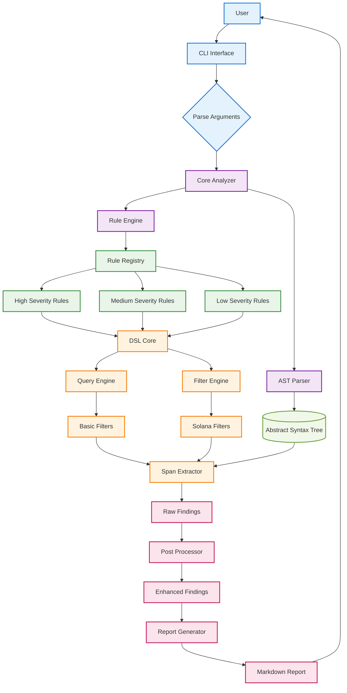
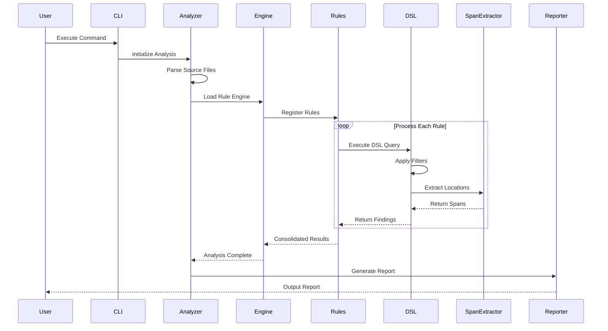
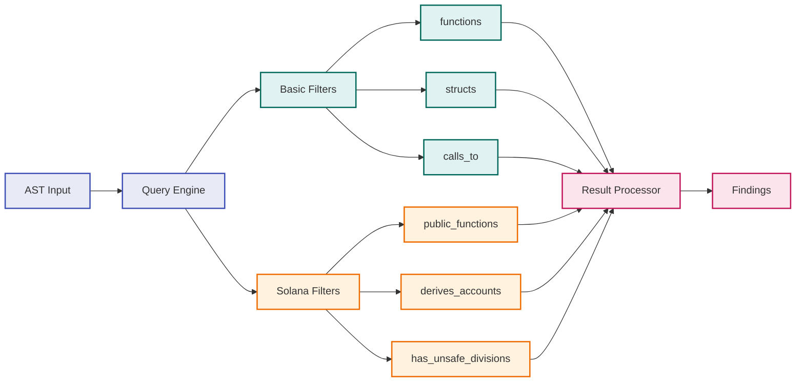
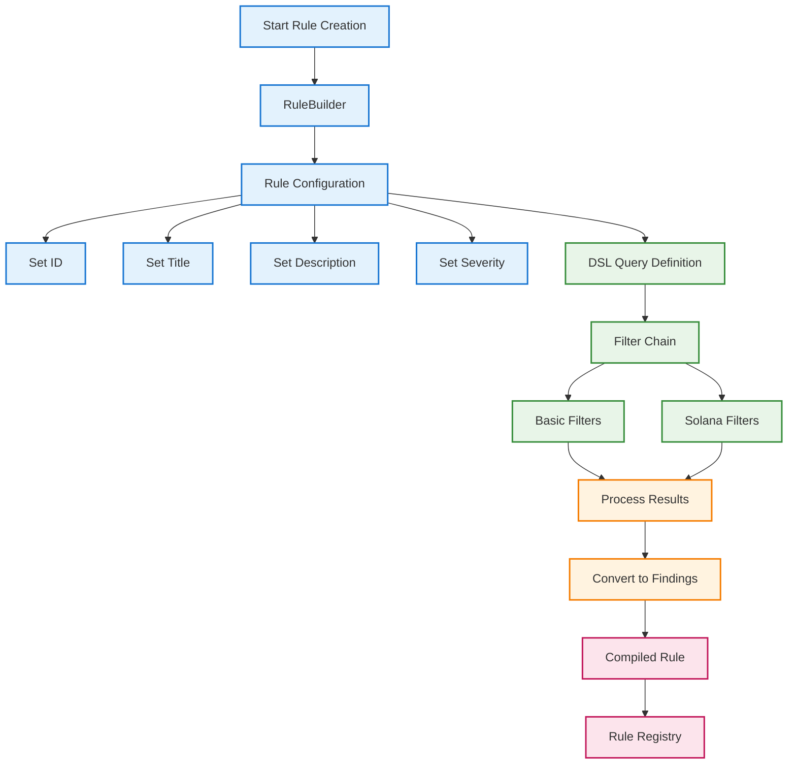
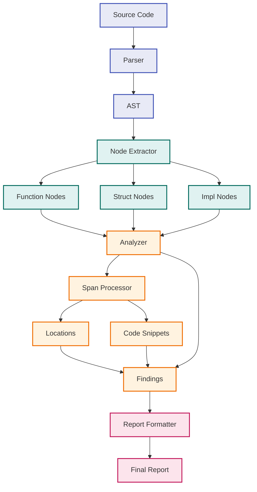
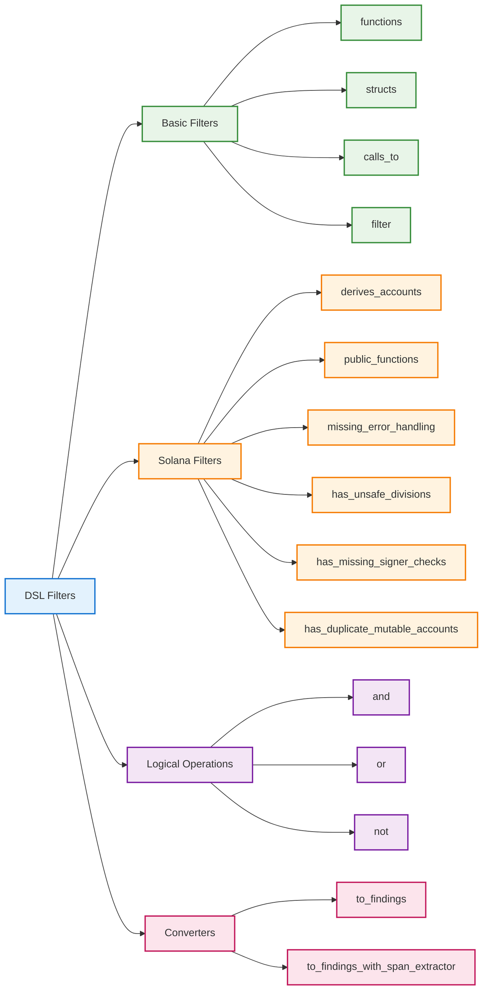

# Solana Analyzer - System Architecture

## System Overview

```mermaid
flowchart TD
    %% Input Layer
    USER[User] --> CLI[CLI Interface]
    CLI --> ARGS{Parse Arguments}
    
    %% Core Processing Layer
    ARGS --> ANALYZER[Core Analyzer]
    ANALYZER --> PARSER[AST Parser]
    PARSER --> AST[(Abstract Syntax Tree)]
    
    %% Rule Engine Layer
    ANALYZER --> ENGINE[Rule Engine]
    ENGINE --> REGISTRY[Rule Registry]
    
    %% Rule Categories
    REGISTRY --> HIGH_RULES[High Severity Rules]
    REGISTRY --> MED_RULES[Medium Severity Rules]
    REGISTRY --> LOW_RULES[Low Severity Rules]
    
    %% DSL Processing
    HIGH_RULES --> DSL_CORE[DSL Core]
    MED_RULES --> DSL_CORE
    LOW_RULES --> DSL_CORE
    
    DSL_CORE --> QUERY_ENGINE[Query Engine]
    DSL_CORE --> FILTER_ENGINE[Filter Engine]
    
    %% Analysis Components
    QUERY_ENGINE --> BASIC_FILTERS[Basic Filters]
    FILTER_ENGINE --> SOLANA_FILTERS[Solana Filters]
    
    BASIC_FILTERS --> SPAN_EXTRACTOR[Span Extractor]
    SOLANA_FILTERS --> SPAN_EXTRACTOR
    
    %% Results Processing
    SPAN_EXTRACTOR --> FINDINGS[Raw Findings]
    FINDINGS --> POST_PROCESSOR[Post Processor]
    POST_PROCESSOR --> ENHANCED_FINDINGS[Enhanced Findings]
    
    %% Output Layer
    ENHANCED_FINDINGS --> REPORTER[Report Generator]
    REPORTER --> OUTPUT[Markdown Report]
    OUTPUT --> USER
    
    %% Data Store
    AST --> SPAN_EXTRACTOR
    
    %% Styling
    classDef inputLayer fill:#e3f2fd,stroke:#1976d2,stroke-width:2px
    classDef coreLayer fill:#f3e5f5,stroke:#7b1fa2,stroke-width:2px
    classDef ruleLayer fill:#e8f5e8,stroke:#388e3c,stroke-width:2px
    classDef dslLayer fill:#fff3e0,stroke:#f57c00,stroke-width:2px
    classDef outputLayer fill:#fce4ec,stroke:#c2185b,stroke-width:2px
    classDef dataLayer fill:#f1f8e9,stroke:#689f38,stroke-width:2px
    
    class USER,CLI,ARGS inputLayer
    class ANALYZER,PARSER,ENGINE coreLayer
    class REGISTRY,HIGH_RULES,MED_RULES,LOW_RULES ruleLayer
    class DSL_CORE,QUERY_ENGINE,FILTER_ENGINE,BASIC_FILTERS,SOLANA_FILTERS,SPAN_EXTRACTOR dslLayer
    class FINDINGS,POST_PROCESSOR,ENHANCED_FINDINGS,REPORTER,OUTPUT outputLayer
    class AST dataLayer
```

## Execution Flow

```mermaid
sequenceDiagram
    participant U as User
    participant C as CLI
    participant A as Analyzer
    participant E as Engine
    participant R as Rules
    participant D as DSL
    participant S as SpanExtractor
    participant Rep as Reporter
    
    U->>C: Execute Command
    C->>A: Initialize Analysis
    A->>A: Parse Source Files
    A->>E: Load Rule Engine
    E->>R: Register Rules
    
    loop Process Each Rule
        R->>D: Execute DSL Query
        D->>D: Apply Filters
        D->>S: Extract Locations
        S-->>D: Return Spans
        D-->>R: Return Findings
    end
    
    R-->>E: Consolidated Results
    E-->>A: Analysis Complete
    A->>Rep: Generate Report
    Rep-->>U: Output Report
```

## DSL Processing Pipeline

```mermaid
flowchart LR
    %% Input
    AST[AST Input] --> QUERY[Query Engine]
    
    %% Basic Processing
    QUERY --> BASIC[Basic Filters]
    BASIC --> FUNCTIONS[functions]
    BASIC --> STRUCTS[structs]
    BASIC --> CALLS[calls_to]
    
    %% Solana Processing
    QUERY --> SOLANA[Solana Filters]
    SOLANA --> PUBLIC[public_functions]
    SOLANA --> ACCOUNTS[derives_accounts]
    SOLANA --> UNSAFE[has_unsafe_divisions]
    
    %% Convergence
    FUNCTIONS --> PROCESSOR[Result Processor]
    STRUCTS --> PROCESSOR
    CALLS --> PROCESSOR
    PUBLIC --> PROCESSOR
    ACCOUNTS --> PROCESSOR
    UNSAFE --> PROCESSOR
    
    %% Output
    PROCESSOR --> FINDINGS[Findings]
    
    %% Styling
    classDef input fill:#e8eaf6,stroke:#3f51b5,stroke-width:2px
    classDef basic fill:#e0f2f1,stroke:#00695c,stroke-width:2px
    classDef solana fill:#fff3e0,stroke:#ef6c00,stroke-width:2px
    classDef output fill:#fce4ec,stroke:#c2185b,stroke-width:2px
    
    class AST,QUERY input
    class BASIC,FUNCTIONS,STRUCTS,CALLS basic
    class SOLANA,PUBLIC,ACCOUNTS,UNSAFE solana
    class PROCESSOR,FINDINGS output
```

## Rule Creation Workflow

```mermaid
flowchart TD
    %% Rule Definition
    START[Start Rule Creation] --> BUILDER[RuleBuilder]
    
    %% Configuration
    BUILDER --> CONFIG[Rule Configuration]
    CONFIG --> ID[Set ID]
    CONFIG --> TITLE[Set Title]
    CONFIG --> DESC[Set Description]
    CONFIG --> SEV[Set Severity]
    
    %% DSL Query
    CONFIG --> DSL[DSL Query Definition]
    DSL --> CHAIN[Filter Chain]
    
    %% Filter Types
    CHAIN --> BASIC_F[Basic Filters]
    CHAIN --> SOLANA_F[Solana Filters]
    
    %% Processing
    BASIC_F --> PROCESS[Process Results]
    SOLANA_F --> PROCESS
    PROCESS --> CONVERT[Convert to Findings]
    
    %% Output
    CONVERT --> RULE[Compiled Rule]
    RULE --> REGISTRY[Rule Registry]
    
    %% Styling
    classDef config fill:#e3f2fd,stroke:#1976d2,stroke-width:2px
    classDef dsl fill:#e8f5e8,stroke:#388e3c,stroke-width:2px
    classDef process fill:#fff3e0,stroke:#f57c00,stroke-width:2px
    classDef output fill:#fce4ec,stroke:#c2185b,stroke-width:2px
    
    class START,BUILDER,CONFIG,ID,TITLE,DESC,SEV config
    class DSL,CHAIN,BASIC_F,SOLANA_F dsl
    class PROCESS,CONVERT process
    class RULE,REGISTRY output
```

## Data Processing Flow

```mermaid
flowchart TD
    %% Input Processing
    SOURCE[Source Code] --> PARSER[Parser]
    PARSER --> AST[AST]
    
    %% Node Extraction
    AST --> EXTRACTOR[Node Extractor]
    EXTRACTOR --> FUNCTIONS[Function Nodes]
    EXTRACTOR --> STRUCTS[Struct Nodes]
    EXTRACTOR --> IMPLS[Impl Nodes]
    
    %% Analysis
    FUNCTIONS --> ANALYZER[Analyzer]
    STRUCTS --> ANALYZER
    IMPLS --> ANALYZER
    
    %% Span Processing
    ANALYZER --> SPAN_PROC[Span Processor]
    SPAN_PROC --> LOCATIONS[Locations]
    SPAN_PROC --> SNIPPETS[Code Snippets]
    
    %% Finding Generation
    LOCATIONS --> FINDINGS[Findings]
    SNIPPETS --> FINDINGS
    ANALYZER --> FINDINGS
    
    %% Output
    FINDINGS --> FORMATTER[Report Formatter]
    FORMATTER --> REPORT[Final Report]
    
    %% Styling
    classDef input fill:#e8eaf6,stroke:#3f51b5,stroke-width:2px
    classDef process fill:#e0f2f1,stroke:#00695c,stroke-width:2px
    classDef analysis fill:#fff3e0,stroke:#ef6c00,stroke-width:2px
    classDef output fill:#fce4ec,stroke:#c2185b,stroke-width:2px
    
    class SOURCE,PARSER,AST input
    class EXTRACTOR,FUNCTIONS,STRUCTS,IMPLS process
    class ANALYZER,SPAN_PROC,LOCATIONS,SNIPPETS,FINDINGS analysis
    class FORMATTER,REPORT output
```

## Available Filters

```mermaid
flowchart LR
    %% Filter Categories
    FILTERS[DSL Filters] --> BASIC[Basic Filters]
    FILTERS --> SOLANA[Solana Filters]
    FILTERS --> LOGICAL[Logical Operations]
    FILTERS --> CONVERT[Converters]
    
    %% Basic Filters
    BASIC --> B1[functions]
    BASIC --> B2[structs]
    BASIC --> B3[calls_to]
    BASIC --> B4[filter]
    
    %% Solana Filters
    SOLANA --> S1[derives_accounts]
    SOLANA --> S2[public_functions]
    SOLANA --> S3[missing_error_handling]
    SOLANA --> S4[has_unsafe_divisions]
    SOLANA --> S5[has_missing_signer_checks]
    SOLANA --> S6[has_duplicate_mutable_accounts]
    
    %% Logical Operations
    LOGICAL --> L1[and]
    LOGICAL --> L2[or]
    LOGICAL --> L3[not]
    
    %% Converters
    CONVERT --> C1[to_findings]
    CONVERT --> C2[to_findings_with_span_extractor]
    
    %% Styling
    classDef category fill:#e3f2fd,stroke:#1976d2,stroke-width:2px
    classDef basic fill:#e8f5e8,stroke:#388e3c,stroke-width:2px
    classDef solana fill:#fff3e0,stroke:#f57c00,stroke-width:2px
    classDef logical fill:#f3e5f5,stroke:#7b1fa2,stroke-width:2px
    classDef convert fill:#fce4ec,stroke:#c2185b,stroke-width:2px
    
    class FILTERS category
    class BASIC,B1,B2,B3,B4 basic
    class SOLANA,S1,S2,S3,S4,S5,S6 solana
    class LOGICAL,L1,L2,L3 logical
    class CONVERT,C1,C2 convert
```
