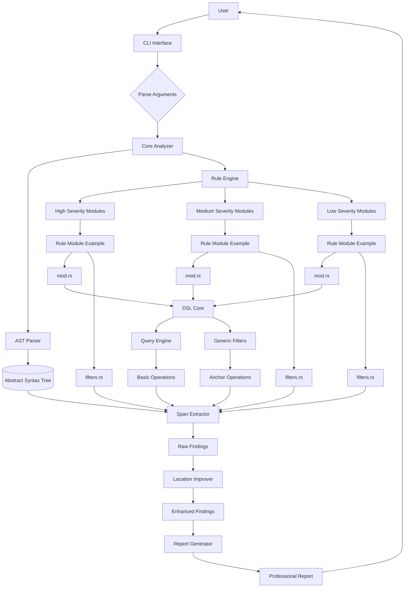
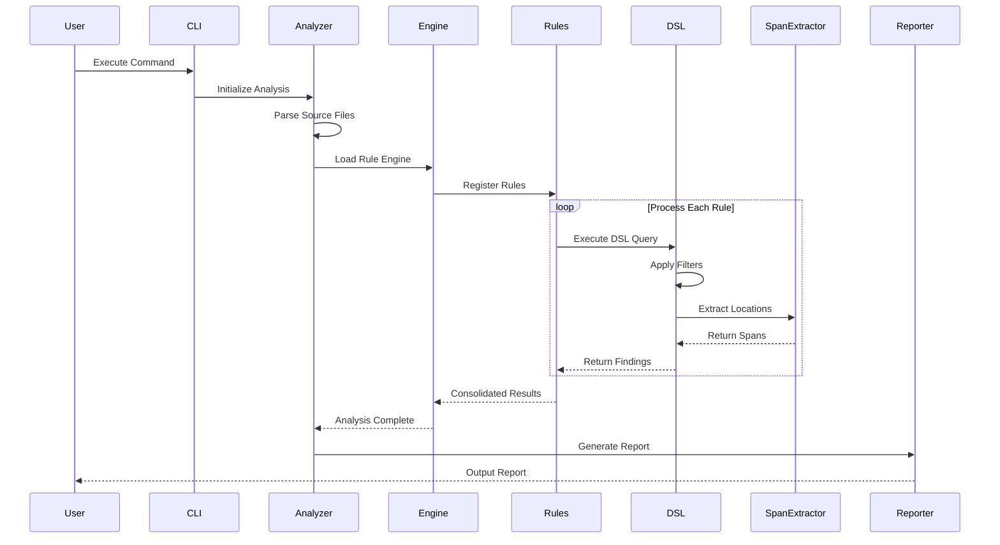
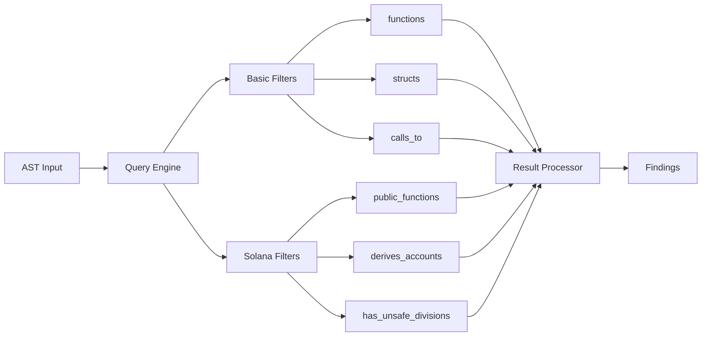
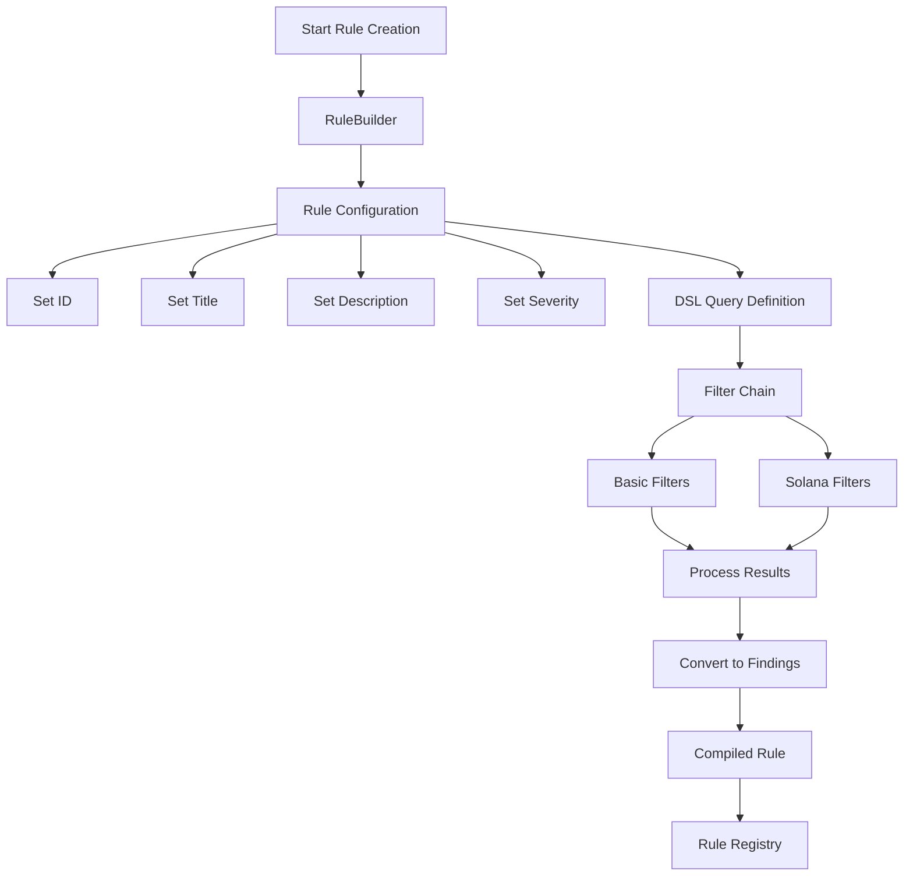
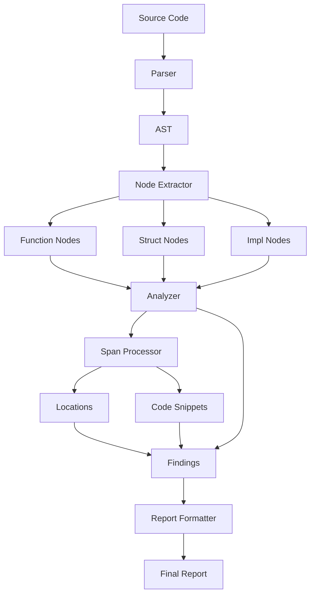
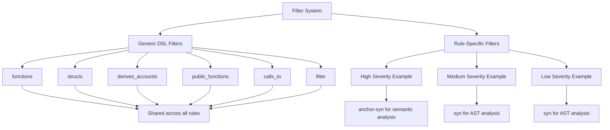

# Solana Analyzer - System Architecture

## System Overview

## Execution Flow

## DSL Processing Pipeline

## Rule Creation Workflow

## Data Processing Flow

## Filter Architecture: Generic vs Rule-Specific

The modular architecture separates filters into **generic DSL filters** (reusable) and **rule-specific filters** (encapsulated):

