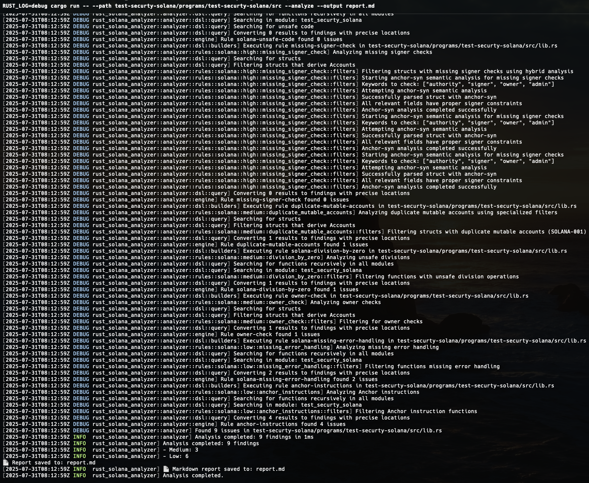

# Solana Analyzer

A powerful static analysis tool for Solana smart contracts written in Rust. Detect vulnerabilities, security issues, and code quality problems in your Solana/Anchor projects.


## Installation

### From Source
```bash
git clone https://github.com/your-org/rust-solana-analyzer.git
cd rust-solana-analyzer
cargo build --release
```


## Quick Start

### Basic Usage
```bash
# Analyze a Solana project with debug logging
RUST_LOG=debug cargo run -- --path test-securty-solana/programs/test-securty-solana/src --analyze --output report.md

# Analyze without debug logging
cargo run -- --path /path/to/your/project --analyze

# Show AST output for debugging
cargo run -- --path src/lib.rs --ast

# Analyze specific files
cargo run -- --path src/lib.rs --analyze --output my-report.md
```

### Command Line Options
```bash
cargo run -- [OPTIONS]

Options:
  --path <PATH>           Path to Solana project or Rust files to analyze
  --analyze               Run vulnerability analysis
  --ast                   Show AST output for debugging
  --output <FILE>         Output report to file (default: stdout)
  --ignore <PATTERNS>     Ignore files matching patterns
  -h, --help              Print help information

Environment Variables:
  RUST_LOG=debug          Enable debug logging
  RUST_LOG=info           Enable info logging
```



## Project Structure

```
rust-solana-analyzer/
├── src/
│   ├── main.rs ................................. CLI
│   ├── ast/ .................................... Modular AST Parser
│   │   ├── mod.rs
│   │   └── parser.rs
│   └── analyzer/
│       ├── mod.rs .............................. Core types (Finding, Severity)
│       ├── engine.rs ........................... Rule Engine
│       ├── span_utils.rs ....................... Precise location system
│       ├── report.rs ........................... Markdown report generator
│       ├── dsl/ ................................ Expressive DSL
│       │   ├── mod.rs
│       │   ├── query.rs ........................ Generic helpers
│       │   └── builders.rs ..................... RuleBuilder fluent API
│       └── rules/solana/ ....................... Modular rules by severity
│           ├── mod.rs
│           ├── high/ ........................... HIGH severity
│           │   ├── unsafe_code/
│           │   │   ├── mod.rs .................. Rule implementation
│           │   │   └── filters.rs .............. Specific filters
│           │   └── missing_signer_check/
│           │       ├── mod.rs
│           │       └── filters.rs
│           ├── medium/ ......................... MEDIUM severity 
│           │   ├── division_by_zero/
│           │   ├── duplicate_mutable_accounts/
│           │   └── owner_check/
│           └── low/ ............................ LOW severity
│               ├── anchor_instructions/
│               └── missing_error_handling/
├── Cargo.toml .................................. Complete dependencies
├── DSL_DOCUMENTATION.md ........................ Updated documentation
└── ARCHITECTURE.md ............................. Technical architecture
```

## Writing Custom Rules

Our DSL makes it easy to write custom vulnerability detectors:

```rust
pub fn create_rule() -> Arc<dyn Rule> {
    RuleBuilder::new()
        .id("my-custom-rule")
        .severity(Severity::Medium)
        .title("Custom Vulnerability Pattern")
        .description("Detects a specific vulnerability pattern")
        .dsl_query(|ast, _file_path, _span_extractor| {
            AstQuery::new(ast)
                .functions()                    // Find all functions
                .public_functions()             // Filter public only
                .calls_to("dangerous_function") // That call dangerous_function
        })
        .build()
}
```

### Available DSL Filters

**Generic Filters:**
- `.functions()` - All functions
- `.structs()` - All structs  
- `.public_functions()` - Public functions only
- `.derives_accounts()` - Structs deriving Accounts
- `.calls_to("name")` - Functions calling specific function
- `.uses_unsafe()` - Code using unsafe blocks
- `.with_name("name")` - Items with specific name

**Custom Filters:**
Each rule can implement custom filters for specific vulnerability patterns.


## Contributing

We welcome contributions! Please see our [Contributing Guide](CONTRIBUTING.md) for details.

### Adding New Rules

1. Create a new directory under `src/analyzer/rules/solana/{severity}/`
2. Implement `mod.rs` with the rule configuration
3. Add specific filters in `filters.rs` if needed
4. Register the rule in the parent module
5. Add tests and documentation

### Development Setup

```bash
git clone https://github.com/your-org/rust-solana-analyzer.git
cd rust-solana-analyzer
cargo build
cargo test
```

## Documentation

- [Architecture Overview](ARCHITECTURE.md)
- [DSL Documentation](DSL_DOCUMENTATION.md)

## Support

- X [ Twitter ](https://x.com/Seecoalba)
- Email: git.seco@protonmail.com

